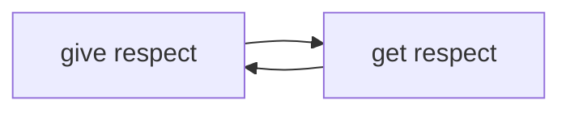

<h2 align="center">Hi , I'm Ashok </h2>

- 🌱 I am a DevOps Engineer apparently
- 🧠 Amplify your intellectual humility
- 🦿 Be better than you were yesterday

<!--

-->

<!--
**ashokm/ashokm** is a ✨ _special_ ✨ repository because its `README.md` (this file) appears on your GitHub profile.
-->
